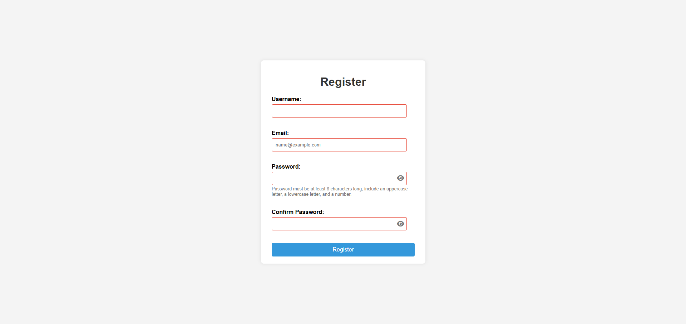

# Interactive User Registration Form

## Overview

For this assignment, I was tasked with building an **Interactive User Registration Form** with the intended goals:

1. Structure an HTML form with appropriate input fields for registration.
2. Implement real-time input validation using JavaScript event listeners (input event).
3. Use HTML5 validation attributes (e.g., required, type, minlength, pattern).
4. Apply the JavaScript Constraint Validation API to check validity and display custom error messages.
5. Dynamically create and display error messages next to input fields.
6. Handle the form submit event, prevent default submission, and perform final validation.
7. Use localStorage to save and retrieve simple form data (e.g., username).

In order to create a responsive and interactive form, I applied a wide range of concepts, including **DOM manipulation**, **event handling**, **HTML5 and JavaScript form validation**, and **localStorage**.

[Click Here to Access Interactive User Registration Form](https://htmlpreview.github.io/?https://github.com/jcwynder/interactive-user-registration-form/blob/main/index.html)

## App Preview

Interactive User Registration Form

## Implementation

To begin working on this assignment, I created 3 files:

- `<index.html>` file to create basic HTML structure of the registration form.
- `<styles.css>` file to apply styling to form.
- `<script.js>` file to implement core validation logic.

### HTML Structure

After creating my required files, I proceeded into the `<index.html>` file to build the HTML structure of the form.

This form is nested within a parent container and includes:

- Input fields for: Username, Email, Password, and Confirm Password.
- A submission button.
- A `` element to display appropiate error messages to correspond with each input.
- Unique `<button>` element(s) used to toggle visibility state (visible or hidden) of `input.values`.

### App Styling

After creating my HTML structure, I moved onto the `<styles.css>` file to apply styling to the app.

The styling applied is used to make the form presentable and to style the error messages.

Below is a list of the styles used and description of their functionality:

`body`:

- `font-family: Arial, sans-serif;`: Sets the default font for the entire page to Arial. If Arial is not available, it will fall back to a generic sans-serif font. This ensures readable text.
- `background-color: #f4f4f4;`: Sets a light gray background color for the entire webpage, providing a neutral backdrop for the content.
- `display: flex;`: Turns the `body` element into a flex container. This enables the use of Flexbox properties for easy layout management of its direct children.
- `justify-content: center;`: Horizontally centers the content within the flex container (in this case, the `.container`).
- `align-items: center;`: Vertically centers the content within the flex container.
- `min-height: 100vh;`: Ensures that the body takes up at least the full height of the viewport (the visible area of the browser window). This is often used to make sure the centered content is truly in the middle of the screen, even if the content itself is short.
- `margin: 0;`: Removes any default margin that the browser might apply to the body, ensuring the flex layout works as intended from the edges of the viewport.

`.container`:

- `background-color: #fff;`: Sets the background color of the container to white, making it stand out against the light gray background of the `body`.
- `padding: 20px 30px;`: Adds internal spacing (padding) of 20 pixels on the top and bottom, and 30 pixels on the left and right, creating some space around the content inside the container.
- `border-radius: 8px;`: Rounds the corners of the container by 8 pixels, giving it a softer appearance.
- `box-shadow: 0 0 10px rgba(0, 0, 0, 0.1);`: Adds a subtle shadow around the container.
  The values represent:
  - `0`: Horizontal offset (no offset).
  - `0`: Vertical offset (no offset).
  - `10px`: Blur radius (creates a soft, diffused shadow).
  - `rgba(0, 0, 0, 0.1)`: Color of the shadow (black with 10% opacity).
- `width: 400px;`: Sets a fixed width of 400 pixels for the container. This will likely hold the form elements.

`h1`:

- `text-align: center;`: Centers the text within the `<h1>` element.
- `color`: #333;: Sets the text color of the `<h1>` to a dark gray.

`.form-group`:

- `margin-bottom: 15px;`: Adds a 15-pixel margin below each `.form-group`, creating vertical spacing between form elements.

`.form-group label`:

- `display: block;`: Makes the label a block-level element, causing it to take up the full width available and appear on its own line.
- `margin-bottom: 5px;`: Adds a small 5-pixel margin below the label, separating it from the input field.
- `font-weight: bold;`: Makes the label text bold for better readability.

`.password-input-container`:

- `position: relative;`: This establishes a containing block for absolutely positioned elements within it. It's essential for positioning the toggle button inside the input field.
- `width: 100%;`: Ensures the container spans the full width of its parent element.

`.password-input-container input`:

- `width: 100%;`: Makes the input field take up the full width of its container.
- `padding: 10px;`: Adds padding inside the input field for better text spacing.
- `padding-right: 40px;`: Creates space on the right side of the input field to accommodate the toggle button without overlapping the text.
- `border: 1px solid #ddd;`: Applies a light gray border around the input field.
- `border-radius: 4px;`: Rounds the corners of the input field for a softer appearance.
- `box-sizing: border-box;`: Includes padding and border in the element's total width and height, preventing layout issues.

`.form-group input[type="text"], .form-group input[type="email"], .form-group input[type="password"]`:

- `width: calc(100% - 22px);`: Sets the width of the input fields to be 100% of their parent container's width minus 22 pixels. This subtraction accounts for the default padding and border that browsers apply to input elements, ensuring the input fields don't overflow their container.
- `padding: 10px;`: Adds 10 pixels of internal spacing around the text inside the input fields.
- `border: 1px solid #ddd;`: Sets a thin, light gray border around the input fields.
- `border-radius: 4px;`: Rounds the corners of the input fields slightly.
- `box-sizing: border-box;`: This is crucial for the `width` calculation. It tells the browser to include the padding and border in the element's total width and height. Without this, the padding and border would be added on top of the specified width, potentially causing layout issues.

`.form-group input:invalid`:

- `border-color: #e74c3c;`: Changes the border color of an input field to a light red if the browser determines it's in an invalid state (e.g., an empty required field or an incorrectly formatted email). This provides visual feedback to the user.

`.form-group .error-message`:

- `display: block;`: Makes the error message a block-level element, so it appears on its own line below the input field.
- `color: #e74c3c;`: Sets the text color of the error message to red, making it clearly visible.
- `font-size: 0.9em;`: Makes the error message slightly smaller than the default font size.
- `margin-top: 5px;`: Adds a small 5-pixel margin above the error message, separating it from the input field.
- `min-height: 1em;`: Reserves a minimum height equal to the height of one line of text. This helps prevent layout shifts when an error message appears or disappears.

`.form-group small`:

- `display: block;`: Makes the small text a block-level element.
- `font-size: 0.8em;`: Makes the small text even smaller.
- `color: #777;`: Sets the color of the small text to a medium gray, often used for hints or supplementary information.
- `margin-top: 3px;`: Adds a small margin above the small text.

`.password-toggle-btn`:

- `position: absolute;`: Positions the toggle button relative to its nearest positioned ancestor (the `.password-input-container`).
- `top: 50%;`: Vertically centers the toggle button within the input field.
- `right: 30px;`: Positions the toggle button 30 pixels from the right edge of the input field.
- `transform: translateY(-50%);`: Adjusts the vertical position to ensure the button is perfectly centered.
- `background: none;`: Removes any default background styling.
- `border: none;`: Removes any default border styling.
- `cursor: pointer;`: Changes the cursor to a pointer, indicating the button is clickable.
- `font-size: 1.1em;`: Sets the font size of the icon inside the button.
- `color: #777;`: Applies a medium gray color to the icon.
- `padding: 0;`: Removes any default padding.
- `line-height: 1;`: Ensures the icon is vertically aligned within the button.

`.password-toggle-btn:hover`:

- `:hover`: Applies styles when the user hovers over the toggle button.
- `color: #333;`: Changes the icon color to a darker gray on hover, providing visual feedback to the user.

`button[type="submit"]`:

- `width: 100%;`: Makes the submit button take up the full width of its parent container.
- `padding: 10px;`: Adds internal spacing to the button.
- `background-color: #3498db;`: Sets a blue background color for the button.
- `color: white;`: Sets the text color of the button to white.
- `border: none;`: Removes the default border from the button.
- `border-radius`: 4px;: Rounds the corners of the button.
- `cursor: pointer;`: Changes the mouse cursor to a pointer when hovering over the button, indicating that it's clickable.
- `font-size: 16px;`: Sets the font size of the button text.

`button[type="submit"]:hover`:

- `background-color: #2980b9;`: Changes the background color of the button to a slightly darker shade of blue when the user hovers their mouse over it, providing visual feedback of interactivity.

### Logic Implementation

After applying styles to the form, the final phase of this assignment required me to implement the validation logic of the form to the `<script.js>` file to provide real-time feedback to the user and demonstrate how to handle user input effectively and persist simple data.

Below is a brief overview of the order of JavaScript code implemented:

- Selected necessary DOM elements (input fields, error message elements,and toggle button for password visibility) using variables.

- Established implementation to load saved data of `userNameInput.value`, from the user's `localStorage`, into Username `input` field upon form refresh.

- Created validation functions for each `input` field.

- Created function to implement toggle functionality of `passwordInput` and `confirmPasswordInput's` visibility.

- Attached event listener to `input` fields to trigger the validation functions on each `input` event whenever user types or changes the value in that input field. This sets up the real-time feedback.

- Attached event listener to `click` to `passwordToggle` and `confirmPasswordToggle` butttons to trigger `passwordInput` and `confirmPasswordInput's` visibility state.

- Attached an event listener to the `submit` event of the form. This handles the final validation and form submission logic.

## Reflection Questions

1. How did `event.preventDefault()` help in handling form submission?

`event.preventDefault()` acts as a gatekeeper for the form submission. It tells the browser to hold off on its default behavior so that my JavaScript code can first validate the data and then handle the submission in a way that I have specifically programmed.

2. What is the difference between using HTML5 validation attributes and JavaScript-based validation? Why might you use both?

HTML5 provides several attributes that can be directly added to the HTML input elements to enforce basic validation rules without writing any JavaScript.

Examples:

- `required`: Makes a field mandatory.
- `type="email"`: Ensures the input value is in a basic email format.
- `type="number", min, max`: For numeric input constraints.
- `minlength, maxlength`: For text length constraints.
- `pattern`: Allows you to specify a regular expression that the input value must match.

JavaScript allows you to implement highly specific and complex validation rules that go beyond what HTML5 attributes offers.

In my code, I have custom checks for:

- Username being non-empty.
- Email matching a specific regular expression (`/^[a-zA-Z0-9.!#$%&'*+/=?^_{|}~-]+@[a-zA-Z0-9-]+(?:\.[a-zA-Z0-9-]+)*$/`).
- Password length, inclusion of lowercase, uppercase, and numeric characters.
- Confirmation password matching the main password.

With JavaScript, you have full control over how error messages are displayed (e.g., the content, styling, and placement using the textContent of the error message elements). You can provide more informative and user-friendly feedback.

Combining HTML5 validation attributes and JavaScript-based validation can provide a more robust and user-friendly experience and ensure a good level of data quality.

3. Explain how you used `localStorage` to persist and retrieve the username. What are the limitations of `localStorage` for storing sensitive data?

When the user successfully registers (submits form when all `input` fields are valid), their entered username is saved in the browser's local storage under the key "username".

This data will persist even after the browser window is closed and reopened (as long as the user doesn't clear their browser data).

If the user has registered before, their username will be automatically pre-filled in the username field when they visit the registration page again.

While `localStorage` provides a convenient way to persist data on the client-side, it has significant limitations when it comes to storing sensitive information:

- No Built-in Encryption
- Security Risks (Cross-Site Scripting - XSS)
- Not Secure Against Malicious Users
- Limited Storage Capacity
- Synchronous Access

While convenient for this specific, relatively non-sensitive piece of information, it is crucial to understand the inherent security limitations of `localStorage` and avoid using it for storing anything that needs strong confidentiality.

4. Describe a challenge you faced in implementing the real-time validation and how you solved it.

A challenge I faced in implementing the real-time validation was figuring out the best practice to render appropiate error messages when conditions of user `input` return `false` during the `input` and `submit` phases of the form.

Although a great portion of this information was provided during initial phase of assignment, I had to learn about new methods when it comes to validating user input data.

Another challenge I faced was properly rendering the display styling of the `togglePassword` and the `toggleConfirmPassword` buttons into the `passwordInput` and `confirmPasswordInput` fields.

To find a solution to this issue, I had to actively monitor the styling properties I applied using the Chrome Dev Tools, and make changes based on what I could see applied. After playing around with some of the styling, I ended up finding a solution.

5. How did you ensure that custom error messages were user-friendly and displayed at the appropriate times?

**Clear and Specific Error Messages:**

- Each validation function sets a specific textContent for the corresponding error message element. For example:
  - `usernameError.textContent = "Username is required.";` is clear about what the user needs to do.
  - `emailError.textContent = "Please enter a valid email address.";` guides the user on the expected format.
  - Password error messages pinpoint the specific criteria that were not met (length, lowercase, uppercase, number).
  - `confirmPasswordError.textContent = "Passwords do not match.";` directly addresses the issue.

**Real-time Feedback (`input` Event Listeners):**

- The `addEventListener("input", validate...)` lines ensure that the validation functions are called as the user types in each input field.

This provides immediate feedback, allowing users to correct errors as they occur, rather than waiting until they try to submit the form.

**Clearing Error Messages on Correction:**

- Within each validation function, if the input is valid, the `textContent` of the corresponding error element is set to an empty string (`""`).

This ensures that error messages disappear as soon as the user corrects the invalid input, reducing clutter and providing a positive visual cue.

**Submission-Time Validation:**

- The `registrationForm.addEventListener("submit", ...)` block performs a final validation check when the user attempts to submit the form.

This is crucial for catching errors if the user somehow bypassed the real-time validation.

**Focusing on the First Invalid Field:**

- In the `submit` event listener's `else` block (when validation fails), the code attempts to focus on the first invalid input field using `inputElement.focus()`.

This helps direct the user's attention to the field they need to correct first.
